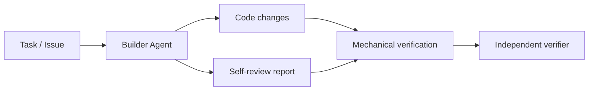
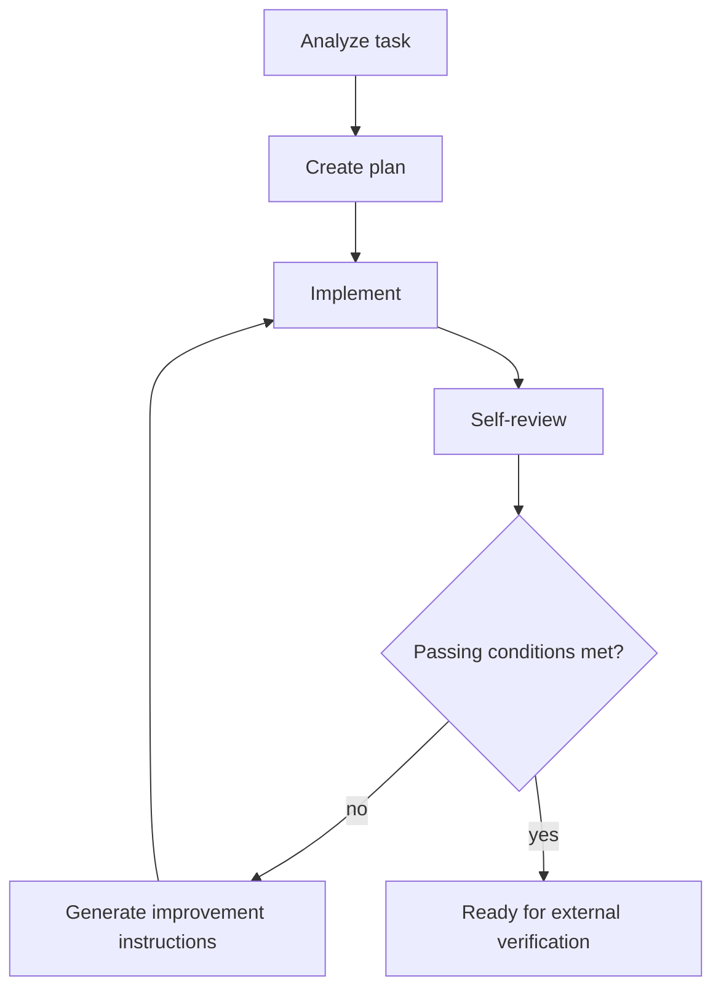

# Builder Agent

Builder Agent is the implementation-focused component of Kaizen Agents. It turns an approved task into code changes, reviews its own work, generates improvement instructions, and repeats until the result is ready for independent verification.

Builder Agent is deliberately not the final quality gate. Its self-review loop improves the implementation before external checks run, but approval remains the responsibility of mechanical verification, the independent verifier, repository policy, and human review where required.

## Role in Kaizen Agents

Kaizen Agents separates responsibility across three main components:

- `kaizen-loop` coordinates intake, workspaces, retry loops, verification, risk decisions, commits, and pull requests.
- `builder-agent` implements tasks and runs an internal self-improvement loop.
- `verifier` independently evaluates the finished result and produces a gate verdict.

Builder Agent owns the build phase only.



## MVP Scope

The first version should be a Codex-compatible skill, not a CLI.

The goal is to validate the self-improvement loop before hardening it into a command-line tool or service. A skill is faster to iterate on, easier to inspect, and keeps the core behavior in prompts and schemas where the loop can be refined.

The MVP accepts:

- A task or issue description
- An optional goal
- Optional constraints
- A review threshold
- A maximum iteration count

It produces:

- Code changes in the current workspace
- A structured self-review report
- A final structured build result

## Responsibility Boundaries

Builder Agent is responsible for:

- Understanding the requested task
- Inspecting the local repository
- Creating an implementation plan
- Implementing the smallest coherent change
- Adding or updating tests when appropriate
- Performing structured self-review
- Generating actionable improvement instructions
- Repeating implementation and review until the threshold is met or progress is blocked

Builder Agent is not responsible for:

- Creating pull requests
- Managing GitHub issues
- Making final approval decisions
- Performing independent verification
- Classifying release risk
- Replacing repository policy or human review

## Internal Loop



Default passing conditions:

- `score >= threshold`
- `mustFix.length === 0`
- `confidence >= 0.7`

`ready` means the result is ready to send to mechanical verification and the independent verifier. It does not mean the change is approved for merge.

## Planned Repository Shape

```text
builder-agent/
├─ SKILL.md
├─ prompts/
│  ├─ analyze.md
│  ├─ implement.md
│  ├─ self-review.md
│  └─ improve.md
├─ schemas/
│  ├─ build-request.schema.json
│  ├─ build-result.schema.json
│  └─ self-review.schema.json
├─ examples/
│  ├─ build-request.example.json
│  └─ self-review.example.json
└─ docs/
   └─ implementation-plan.md
```

See [Implementation Plan](docs/implementation-plan.md) for the proposed build order.
