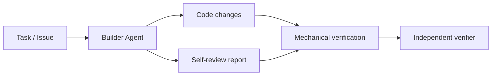
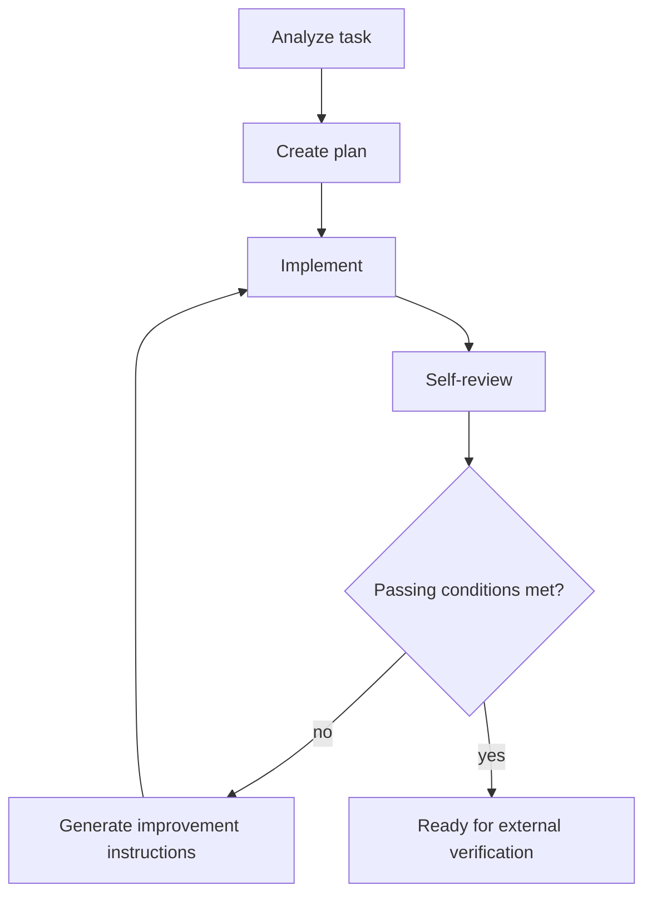

# Builder Agent

Builder Agent is the implementation-focused component of Kaizen Agents. It turns an accepted issue or scoped task into code changes, reviews its own work, generates improvement instructions, and repeats until the result is ready for independent verification.

Builder Agent is deliberately not the final quality gate. Its self-review loop improves the implementation before external checks run, but approval remains the responsibility of mechanical verification, the independent verifier, repository policy, and human review where required.

## Role in Kaizen Agents

Kaizen Agents separates responsibility across three main components:

- `kaizen-loop` coordinates intake, workspaces, retry loops, verification, risk decisions, commits, and pull requests.
- `builder-agent` implements tasks and runs an internal self-improvement loop.
- `verifier` independently evaluates the finished result and produces a gate verdict.

Builder Agent owns the build phase only.



## MVP Scope

The current MVP includes both:

- A Codex-compatible skill that describes the implementation workflow.
- A small Node.js loop controller and CLI that can be called by Kaizen orchestration.

The MVP accepts:

- A task or issue description
- An optional goal
- Optional constraints
- A review threshold
- A maximum iteration count

It produces:

- Code changes in the current workspace
- A structured self-review report
- A final structured build result
- Structured discovered issues for separate bugs found during implementation

The final handoff must be reviewable by `kaizen-loop`, the independent verifier, and human reviewers. It should make clear what changed, why the change was made, which verification ran or was skipped, residual risk, and reviewer notes when relevant. This is implementation evidence only; it is not approval.

For standalone loop development, the CLI loads an adapter module that performs the task-specific implementation steps. For `kaizen-loop` integration, the same executable can also run as a thin command adapter around Claude Code or Codex and write the result contract expected by the orchestrator.

## Reusable TypeScript Boundaries

The package is migrating incrementally from JavaScript to TypeScript. Runtime entrypoints remain compatible with the current CLI, while `npm run build` emits JavaScript and declarations into `dist/` for typed reuse.

Current boundaries:

- CLI (`src/cli.js`): parses commands, environment, adapter paths, request JSON, and output paths.
- Contract layer (`src/types/`): owns normalized build request, build result, self-review, discovered issue, and adapter types.
- Agent runner (`src/agents/AgentRunner.js`): invokes Codex or Claude behind a small provider interface.
- Builder service (`src/builder/BuilderAgent.js`): orchestrates analyze, implement, review, and improve iterations without GitHub policy knowledge.
- Artifact writer (`src/artifacts.js`): persists final and per-iteration handoff artifacts.

Generated declarations are published from `dist/index.d.ts`. The source CLI remains `src/cli.js` so existing orchestration calls do not need to change during the migration.

## Responsibility Boundaries

Builder Agent is responsible for:

- Understanding the requested task
- Inspecting the local repository
- Creating an implementation plan
- Implementing the smallest coherent change
- Adding or updating tests when appropriate
- Performing structured self-review
- Generating actionable improvement instructions
- Repeating implementation and review until the threshold is met or progress is blocked

Builder Agent is not responsible for:

- Creating pull requests
- Managing GitHub issues
- Making final approval decisions
- Performing independent verification
- Classifying release risk
- Replacing repository policy or human review

If Builder Agent discovers a separate bug while working, it reports that finding as structured data. The orchestrator decides whether and where to file a GitHub issue.

## Internal Loop



Default passing conditions:

- `score >= threshold`
- `mustFix.length === 0`
- `confidence >= 0.7`

`ready` means the result is ready to send to mechanical verification and the independent verifier. It does not mean the change is approved for merge.

## CLI Usage

Check installation:

```sh
node src/cli.js --version
```

Build typed output:

```sh
npm run build
```

Validate a request:

```sh
npm run validate:json
node src/cli.js validate-request --request examples/build-request.example.json
```

`npm run validate:json` parses the published schemas and validates the checked-in examples against the same runtime contract used by the CLI. The schemas in `schemas/` are the MVP contract for orchestration boundaries:

- [build-request.schema.json](schemas/build-request.schema.json): input accepted by Builder Agent.
- [self-review.schema.json](schemas/self-review.schema.json): adapter self-review output before controller recomputes `passed`.
- [build-result.schema.json](schemas/build-result.schema.json): final artifact written for external verification handoff, including changed files, review findings, and residual notes.

Run the builder loop with an adapter:

```sh
node src/cli.js build \
  --request examples/build-request.example.json \
  --adapter examples/adapter.example.js \
  --out .kaizen/builder
```

The command writes:

- `.kaizen/builder/self-review.json`
- `.kaizen/builder/build-result.json`
- `.kaizen/builder/iterations/<n>/implementation-summary.json`
- `.kaizen/builder/iterations/<n>/self-review.json`
- `.kaizen/builder/iterations/<n>/improvement-instructions.json`
- `.kaizen/builder/iterations/<n>/residual-notes.json`

The top-level files always contain the latest/final handoff for compatibility. Each completed implementation/self-review iteration is also retained under `iterations/<n>/` so reviewers can inspect how the loop changed, converged, or became blocked.

Exit codes:

- `0`: ready
- `2`: blocked
- `3`: failed

## Kaizen Loop Integration

When `kaizen-loop` invokes `builder-agent`, it calls the command with no arguments, passes the implementation prompt on stdin, and expects a JSON result file.

```sh
KAIZEN_BUILD_RESULT_PATH=.kaizen/builder/build-result.json \
KAIZEN_WORKSPACE_DIR="$PWD" \
KAIZEN_PREFERRED_AGENT=claude \
builder-agent < prompt.txt
```

Required environment:

- `KAIZEN_BUILD_RESULT_PATH`: file path where Builder Agent writes the orchestration result.

Optional environment:

- `KAIZEN_WORKSPACE_DIR`: repository workspace. Defaults to the current directory.
- `KAIZEN_PREFERRED_AGENT`: `claude` or `codex`. Defaults to `claude`.
- `KAIZEN_AGENT_MODEL`: model name passed through to the selected backend.

The integration payload is intentionally smaller than the standalone build artifact:

```json
{
  "status": "fixed",
  "summary": "Short implementation summary.",
  "notes": "",
  "discoveredIssues": [
    {
      "title": "Verifier treats the word rejected in summaries as a hard failure",
      "repo": "verifier",
      "body": "The verifier rejected an otherwise passing run because the builder summary mentioned a legacy status name.",
      "expected": "Only actual verification failures should block PR creation.",
      "evidence": "verifier.log showed a must_fix from builder summary text."
    }
  ]
}
```

`status` is one of `fixed`, `partial`, or `blocked`. The `summary` should state what changed and why. The `notes` field should capture verification run or skipped, residual risk, and reviewer notes when relevant. `discoveredIssues` is optional and defaults to an empty array. `builder-agent` does not create pull requests, push branches, or file GitHub issues; those remain `kaizen-loop` responsibility.

## Adapter Contract

An adapter module must export either `createAdapter()` or an object with these async methods:

```js
export function createAdapter() {
  return {
    async analyzeTask({ request }) {},
    async createPlan({ request, analysis }) {},
    async implement({ request, analysis, plan, iteration }) {},
    async selfReview({ request, analysis, plan, implementation, iteration, threshold }) {},
    async improve({ request, analysis, plan, implementation, review, instructions, iteration }) {}
  };
}
```

`selfReview()` must return an object compatible with [self-review.schema.json](schemas/self-review.schema.json). The controller recomputes `passed` from the default passing conditions, so adapters cannot blindly approve themselves by setting `passed: true`.

## Repository Shape

```text
builder-agent/
├─ package.json
├─ SKILL.md
├─ src/
│  ├─ builder/
│  ├─ review/
│  └─ types/
├─ prompts/
│  ├─ analyze.md
│  ├─ implement.md
│  ├─ self-review.md
│  └─ improve.md
├─ schemas/
│  ├─ build-request.schema.json
│  ├─ build-result.schema.json
│  └─ self-review.schema.json
├─ examples/
│  ├─ adapter.example.js
│  ├─ build-request.example.json
│  ├─ build-result.example.json
│  └─ self-review.example.json
├─ test/
│  └─ builder-agent.test.js
└─ docs/
   └─ implementation-plan.md
```

See [Implementation Plan](docs/implementation-plan.md) for the proposed build order.
