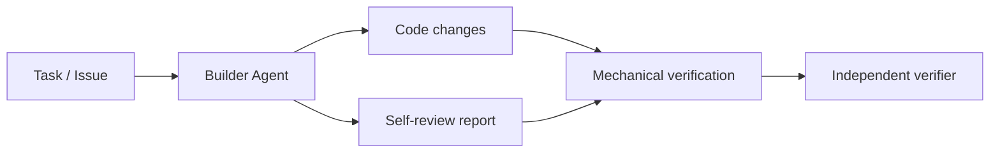
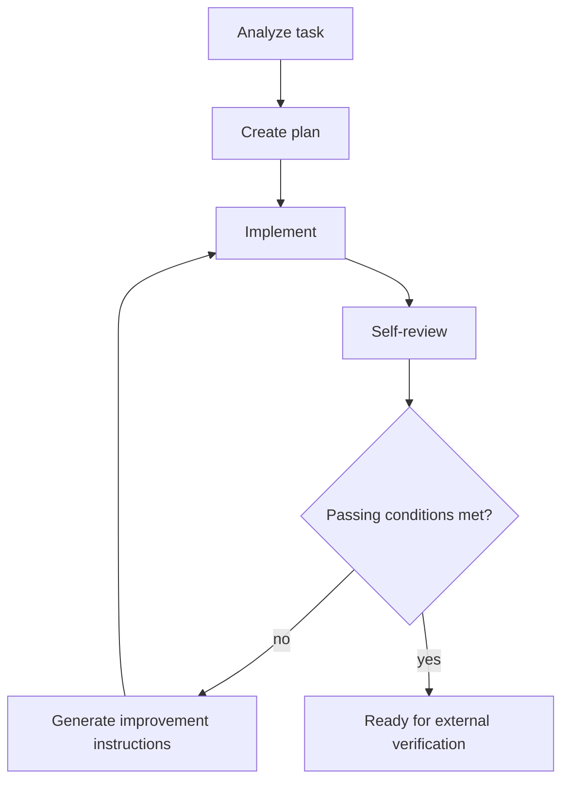

# Builder Agent

Builder Agent is the implementation-focused component of Kaizen Agents. It turns an approved task into code changes, reviews its own work, generates improvement instructions, and repeats until the result is ready for independent verification.

Builder Agent is deliberately not the final quality gate. Its self-review loop improves the implementation before external checks run, but approval remains the responsibility of mechanical verification, the independent verifier, repository policy, and human review where required.

## Role in Kaizen Agents

Kaizen Agents separates responsibility across three main components:

- `kaizen-loop` coordinates intake, workspaces, retry loops, verification, risk decisions, commits, and pull requests.
- `builder-agent` implements tasks and runs an internal self-improvement loop.
- `verifier` independently evaluates the finished result and produces a gate verdict.

Builder Agent owns the build phase only.



## MVP Scope

The current MVP includes both:

- A Codex-compatible skill that describes the implementation workflow.
- A small Node.js loop controller and CLI that can be called by Kaizen orchestration.

The MVP accepts:

- A task or issue description
- An optional goal
- Optional constraints
- A review threshold
- A maximum iteration count

It produces:

- Code changes in the current workspace
- A structured self-review report
- A final structured build result

The CLI does not call an LLM by itself. Instead, it loads an adapter module that performs the task-specific implementation steps. This keeps Builder Agent responsible for loop control and structured artifacts while allowing `kaizen-loop` to decide how Codex, Claude Code, or another implementation backend is invoked.

## Responsibility Boundaries

Builder Agent is responsible for:

- Understanding the requested task
- Inspecting the local repository
- Creating an implementation plan
- Implementing the smallest coherent change
- Adding or updating tests when appropriate
- Performing structured self-review
- Generating actionable improvement instructions
- Repeating implementation and review until the threshold is met or progress is blocked

Builder Agent is not responsible for:

- Creating pull requests
- Managing GitHub issues
- Making final approval decisions
- Performing independent verification
- Classifying release risk
- Replacing repository policy or human review

## Internal Loop



Default passing conditions:

- `score >= threshold`
- `mustFix.length === 0`
- `confidence >= 0.7`

`ready` means the result is ready to send to mechanical verification and the independent verifier. It does not mean the change is approved for merge.

## CLI Usage

Validate a request:

```sh
npm run validate:json
node src/cli.js validate-request --request examples/build-request.example.json
```

`npm run validate:json` parses the published schemas and validates the checked-in examples against the same runtime contract used by the CLI. The schemas in `schemas/` are the MVP contract for orchestration boundaries:

- [build-request.schema.json](schemas/build-request.schema.json): input accepted by Builder Agent.
- [self-review.schema.json](schemas/self-review.schema.json): adapter self-review output before controller recomputes `passed`.
- [build-result.schema.json](schemas/build-result.schema.json): final artifact written for external verification handoff.

Run the builder loop with an adapter:

```sh
node src/cli.js build \
  --request examples/build-request.example.json \
  --adapter examples/adapter.example.js \
  --out .kaizen/builder
```

The command writes:

- `.kaizen/builder/self-review.json`
- `.kaizen/builder/build-result.json`

Exit codes:

- `0`: ready
- `2`: blocked
- `3`: failed

## Adapter Contract

An adapter module must export either `createAdapter()` or an object with these async methods:

```js
export function createAdapter() {
  return {
    async analyzeTask({ request }) {},
    async createPlan({ request, analysis }) {},
    async implement({ request, analysis, plan, iteration }) {},
    async selfReview({ request, analysis, plan, implementation, iteration, threshold }) {},
    async improve({ request, analysis, plan, implementation, review, instructions, iteration }) {}
  };
}
```

`selfReview()` must return an object compatible with [self-review.schema.json](schemas/self-review.schema.json). The controller recomputes `passed` from the default passing conditions, so adapters cannot blindly approve themselves by setting `passed: true`.

## Repository Shape

```text
builder-agent/
├─ package.json
├─ SKILL.md
├─ src/
│  ├─ builder/
│  ├─ review/
│  └─ types/
├─ prompts/
│  ├─ analyze.md
│  ├─ implement.md
│  ├─ self-review.md
│  └─ improve.md
├─ schemas/
│  ├─ build-request.schema.json
│  ├─ build-result.schema.json
│  └─ self-review.schema.json
├─ examples/
│  ├─ adapter.example.js
│  ├─ build-request.example.json
│  ├─ build-result.example.json
│  └─ self-review.example.json
├─ test/
│  └─ builder-agent.test.js
└─ docs/
   └─ implementation-plan.md
```

See [Implementation Plan](docs/implementation-plan.md) for the proposed build order.
